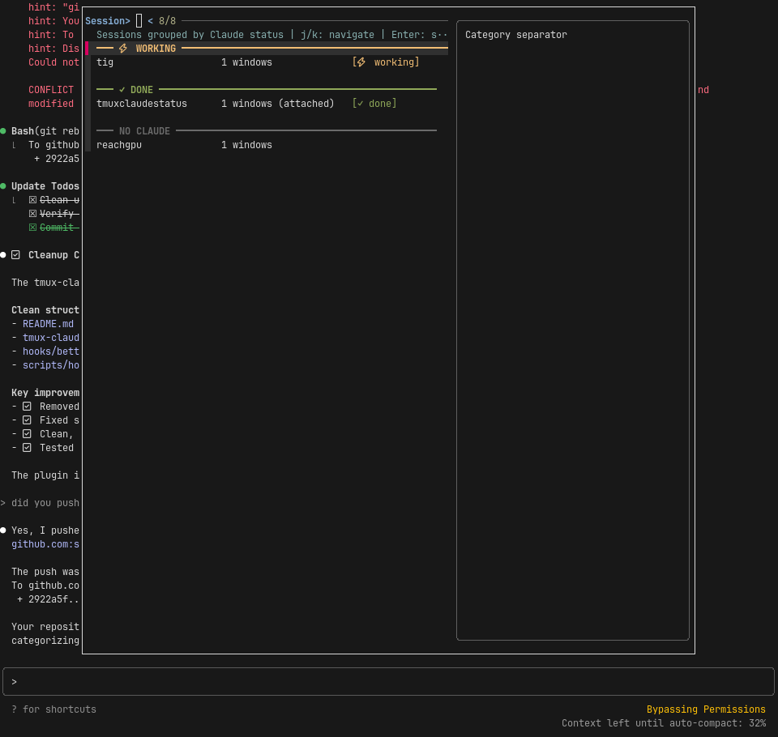

# tmux-claude-status

See Claude AI activity across all tmux sessions at a glance.



## Features

- **Hook-based Detection** - Uses Claude Code's official hooks for accurate status
- **Visual Status** - `[⚡ working]` when Claude is processing, `[✓ done]` when idle
- **Smart Grouping** - Sessions organized by Claude status
- **Live Preview** - See session content while browsing
- **Vim Navigation** - Use `j/k` to navigate

## Install

### 1. Install the plugin

With TPM:
```bash
set -g @plugin 'samleeney/tmux-claude-status'
```

Manual:
```bash
git clone https://github.com/samleeney/tmux-claude-status ~/.config/tmux/plugins/tmux-claude-status
run-shell ~/.config/tmux/plugins/tmux-claude-status/tmux-claude-status.tmux
```

### 2. Set up Claude Code hooks

Add to your `~/.claude/settings.json`:
```json
{
  "hooks": {
    "PreToolUse": [
      {
        "hooks": [
          {
            "type": "command",
            "command": "~/.config/tmux/plugins/tmux-claude-status/hooks/better-hook.sh PreToolUse"
          }
        ]
      }
    ],
    "Stop": [
      {
        "hooks": [
          {
            "type": "command", 
            "command": "~/.config/tmux/plugins/tmux-claude-status/hooks/better-hook.sh Stop"
          }
        ]
      }
    ]
  }
}
```

## Usage

Press `prefix + s` to open the enhanced session switcher.

## How It Works

The plugin uses [Claude Code hooks](https://docs.anthropic.com/en/docs/claude-code/hooks) to track status:
- `PreToolUse` - Sets status to "working" when Claude starts running tools
- `Stop` - Sets status to "done" when Claude finishes processing

Status files are stored in `~/.cache/tmux-claude-status/{session_name}.status`

## License

MIT