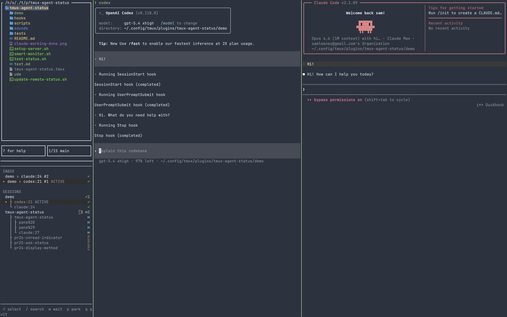

# tmux-agent-status

Sidebar-first AI agent session manager for tmux. It gives each tmux session a persistent status sidebar, keeps a compact summary in the status line, and adds a hierarchical `fzf` target switcher for fast jumps and cleanup across agent sessions, windows, and panes.

Claude Code and Codex CLI are both integrated through hooks, so their states come from agent lifecycle events rather than fragile process polling. Custom agents can still integrate through status files or collector extensions.

[](demo/full.mp4)

Demo video: [`demo/full.mp4`](demo/full.mp4)

## Features

- Persistent sidebar in every tmux session
- Hierarchical `fzf` target switcher for quick jumps and close actions
- Hook-based Claude Code and Codex tracking
- Wait and park modes for triaging work
- Compact status-line summary with finish notifications
- Works across multi-pane sessions, worktrees, and remote tmux sessions

## Supported Agents

| Agent | Integration | Status |
|-------|-------------|--------|
| [Claude Code](https://docs.anthropic.com/en/docs/claude-code) | Hook-based via `hooks/better-hook.sh` | Stable |
| [Codex CLI](https://github.com/openai/codex) | Hook-based via `hooks/codex-hook.sh` | Stable in plugin, hooks still experimental upstream |
| Custom (Aider, Cline, Copilot CLI, etc.) | Status files or collector extensions | Stable |

All agent sessions can run simultaneously across tmux sessions and panes, each tracked independently.

## Install

With [TPM](https://github.com/tmux-plugins/tpm):

```bash
set -g @plugin 'samleeney/tmux-agent-status'
```

Then press `prefix + I` to install.

By default the plugin:

- Appends the live summary to `status-right`
- Starts the sidebar collector daemon
- Auto-creates a sidebar in existing and new tmux sessions
- Binds the popup switcher, wait, park, and next-ready actions

## Claude Code Setup

Add hooks to `~/.claude/settings.json`:

```json
{
  "hooks": {
    "UserPromptSubmit": [
      {
        "hooks": [
          {
            "type": "command",
            "command": "~/.config/tmux/plugins/tmux-agent-status/hooks/better-hook.sh UserPromptSubmit"
          }
        ]
      }
    ],
    "PreToolUse": [
      {
        "hooks": [
          {
            "type": "command",
            "command": "~/.config/tmux/plugins/tmux-agent-status/hooks/better-hook.sh PreToolUse"
          }
        ]
      }
    ],
    "Stop": [
      {
        "hooks": [
          {
            "type": "command",
            "command": "~/.config/tmux/plugins/tmux-agent-status/hooks/better-hook.sh Stop"
          }
        ]
      }
    ],
    "Notification": [
      {
        "hooks": [
          {
            "type": "command",
            "command": "~/.config/tmux/plugins/tmux-agent-status/hooks/better-hook.sh Notification"
          }
        ]
      }
    ]
  }
}
```

Claude Code state is tracked entirely through hooks, so the plugin gets precise working/done transitions directly from the agent.

## Codex CLI Setup

tmux-agent-status supports official [Codex hooks](https://developers.openai.com/codex/hooks).

Enable hooks in `~/.codex/config.toml`:

```toml
[features]
codex_hooks = true
```

To enable Codex tracking globally, add `~/.codex/hooks.json`:

```json
{
  "hooks": {
    "SessionStart": [
      {
        "matcher": "startup|resume",
        "hooks": [
          {
            "type": "command",
            "command": "bash ~/.config/tmux/plugins/tmux-agent-status/hooks/codex-hook.sh SessionStart"
          }
        ]
      }
    ],
    "UserPromptSubmit": [
      {
        "hooks": [
          {
            "type": "command",
            "command": "bash ~/.config/tmux/plugins/tmux-agent-status/hooks/codex-hook.sh UserPromptSubmit"
          }
        ]
      }
    ],
    "PreToolUse": [
      {
        "matcher": "Bash",
        "hooks": [
          {
            "type": "command",
            "command": "bash ~/.config/tmux/plugins/tmux-agent-status/hooks/codex-hook.sh PreToolUse"
          }
        ]
      }
    ],
    "Stop": [
      {
        "hooks": [
          {
            "type": "command",
            "command": "bash ~/.config/tmux/plugins/tmux-agent-status/hooks/codex-hook.sh Stop"
          }
        ]
      }
    ]
  }
}
```

Codex state is also hook-based. The handler marks the tmux session or pane `working` on `UserPromptSubmit` and `PreToolUse`, resets it to `done` on `Stop`, and seeds resumed sessions on `SessionStart`.

This repo also ships a repo-local [`.codex/hooks.json`](.codex/hooks.json), so Codex can pick up the same hook handler automatically when you work inside `tmux-agent-status` itself.

## Custom Agent Integration

Integrate any AI coding tool with either of these approaches:

1. Write `working`, `done`, or `wait` to `~/.cache/tmux-agent-status/<session>.status`
2. For pane-level parking or per-pane state, write to `~/.cache/tmux-agent-status/panes/<session>_<pane>.status` and `~/.cache/tmux-agent-status/parked/<session>_<pane>.parked`
3. Extend the collector scan in [`scripts/lib/collect.sh`](scripts/lib/collect.sh) if you want automatic process-based tracking

## Usage

Default mode is sidebar-first:

- Every tmux session gets a sidebar pane automatically
- `prefix + S` opens the hierarchical `fzf` target switcher
- `prefix + o` focuses or creates the sidebar in the current window

| Key | Action |
|-----|--------|
| `prefix + S` | Open the hierarchical `fzf` target switcher |
| `prefix + o` | Focus or create the sidebar |
| `prefix + N` | Jump to the next ready or done agent session |
| `prefix + W` | Put the current session or pane into timed wait mode |
| `prefix + p` | Park the current session or pane for later |

The status bar shows live activity:

- `⚡ agent working`
- `⚡ 3 working ⏸ 1 waiting ✓ 2 done`
- `✓ All agents ready`

Parked sessions stay visible in the sidebar and switcher, but are excluded from the status-line summary.

Inside the sidebar and popup switcher:

- `Enter` switches to the selected session, window, or pane
- `Tab` expands or collapses the selected session or window in the popup switcher
- `x` closes the selected pane immediately
- `x` on a window closes that window and all child panes after confirmation
- `x` on a session closes that session and all child windows and panes after confirmation

## Configuration

```tmux
set -g @agent-status-key "S"
set -g @agent-sidebar-key "o"
set -g @agent-next-done-key "N"
set -g @agent-wait-key "W"
set -g @agent-park-key "p"

set -g @agent-switcher-style "both"        # popup | sidebar | both
set -g @agent-status-display-method "popup" # popup | window
set -g @agent-sidebar-width "40"
```

`@agent-switcher-style "both"` is the default. It keeps the persistent sidebar and leaves `prefix + S` as the lightweight popup switcher.

## Notification Sounds

Play a sound when an agent finishes:

```tmux
set -g @agent-notification-sound "chime"
```

Options: `chime` (default), `bell`, `fanfare`, `frog`, `speech`, `none`.

## Multi-Agent Deploy

Launch parallel AI coding sessions with isolated git worktrees:

```bash
bash ~/.config/tmux/plugins/tmux-agent-status/scripts/deploy-sessions.sh manifest.json
```

Each session gets a `deploy/<name>` branch, and the plugin tracks the spawned sessions automatically.

## SSH Remote Sessions

Monitor AI agents on remote machines:

```bash
./setup-server.sh <session-name> <ssh-host>
```

Works with cloud VMs, GPU boxes, and any SSH-accessible tmux host.

## How It Works

```text
┌──────────────┐    hooks     ┌──────────────────────────┐
│ Claude Code  ├─────────────►│ ~/.cache/tmux-agent-     │
└──────────────┘              │ status/                  │
                              │ <session>.status         │
┌──────────────┐    hooks     │ panes/*.status           │
│ Codex CLI    ├─────────────►│ wait/*.wait              │
└──────────────┘              │ parked/*.parked          │
                              └─────────────┬────────────┘
┌──────────────┐ status files               │
│ Custom agent ├────────────────────────────┘
└──────────────┘
                                            ▼
                              ┌──────────────────────────┐
                              │ sidebar-collector.sh     │
                              │ writes shared cache and  │
                              │ status summary           │
                              └─────────────┬────────────┘
                                            │
                         ┌──────────────────┼──────────────────┐
                         ▼                  ▼                  ▼
                 ┌──────────────┐   ┌──────────────┐   ┌──────────────┐
                 │ sidebar pane │   │ status line  │   │ fzf switcher │
                 └──────────────┘   └──────────────┘   └──────────────┘
```

- Claude Code support is hook-based
- Codex CLI support is hook-based
- Custom agents can be file-based or process-detected
- The sidebar is the main live view; the `fzf` switcher is the quick jump and close tool

## License

MIT
