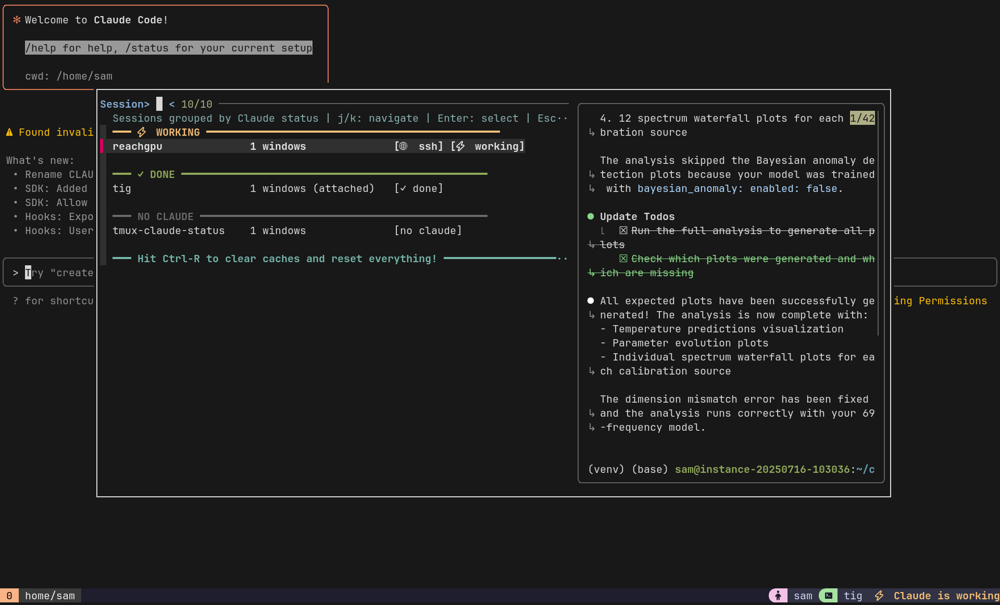

# tmux-agent-status

AI agent session manager for tmux. Monitor and orchestrate multiple AI coding assistants (Claude Code, OpenAI Codex CLI, and custom agents) from your tmux status bar.

Real-time status tracking, session switching, and notification sounds for multi-agent terminal workflows.



## Supported Agents

| Agent | Detection | Status |
|-------|-----------|--------|
| [Claude Code](https://docs.anthropic.com/en/docs/claude-code) (Anthropic) | Hook-based (4 events) | Stable |
| [Codex CLI](https://github.com/openai/codex) (OpenAI / ChatGPT) | Process polling + notify | Experimental |
| Custom (Aider, Cline, Copilot CLI, etc.) | Status files or process polling | Stable |

All agents can run **simultaneously** across tmux sessions, each tracked independently.

## Install

With [TPM](https://github.com/tmux-plugins/tpm):
```bash
set -g @plugin 'samleeney/tmux-agent-status'
```

Then `prefix + I` to install. Previously `tmux-claude-status`; the old name redirects automatically.

## Claude Code Setup

Add hooks to `~/.claude/settings.json`:
```json
{
  "hooks": {
    "UserPromptSubmit": [
      { "hooks": [{ "type": "command", "command": "~/.config/tmux/plugins/tmux-agent-status/hooks/better-hook.sh UserPromptSubmit" }] }
    ],
    "PreToolUse": [
      { "hooks": [{ "type": "command", "command": "~/.config/tmux/plugins/tmux-agent-status/hooks/better-hook.sh PreToolUse" }] }
    ],
    "Stop": [
      { "hooks": [{ "type": "command", "command": "~/.config/tmux/plugins/tmux-agent-status/hooks/better-hook.sh Stop" }] }
    ],
    "Notification": [
      { "hooks": [{ "type": "command", "command": "~/.config/tmux/plugins/tmux-agent-status/hooks/better-hook.sh Notification" }] }
    ]
  }
}
```

Precise agent status via [Claude Code hooks](https://docs.anthropic.com/en/docs/claude-code/hooks). The AI reports its own state transitions.

## OpenAI Codex CLI Setup (Experimental)

Codex CLI (OpenAI's terminal AI agent) lacks full lifecycle hooks ([tracking issue](https://github.com/openai/codex/issues/2109), PRs [#2904](https://github.com/openai/codex/pull/2904), [#9796](https://github.com/openai/codex/pull/9796), [#11067](https://github.com/openai/codex/pull/11067)). This plugin uses a hybrid approach:

- **"Working"**: Process polling (`pgrep`) checks every 1s for a running `codex` process
- **"Done"**: Codex `notify` fires on agent turn completion

Add to `~/.codex/config.toml`:
```toml
notify = ["~/.config/tmux/plugins/tmux-agent-status/hooks/codex-notify.sh"]
```

When Codex ships proper event hooks, the plugin will upgrade to hook-based tracking.

## Custom Agent Integration

Integrate any AI coding tool (Aider, Continue, Cursor, Cline, GitHub Copilot CLI, Goose, Amazon Q, Windsurf, or your own agent):

1. **Status files**: Write `working` or `done` to `~/.cache/tmux-agent-status/<session>.status`
2. **Process polling**: Add your process name to `check_agent_processes()` in `scripts/status-line.sh`

## Usage

| Key | Action |
|-----|--------|
| `prefix + S` | AI session manager: switcher grouped by agent state |
| `prefix + N` | Jump to next idle AI session |
| `prefix + W` | Snooze session (timed wait mode) |

The status bar shows live agent activity:
- `⚡ agent working` / `⚡ 3 working ✓ 2 done` / `✓ All agents ready`

### Keybindings

```tmux
set -g @agent-status-key "s"
set -g @agent-next-done-key "n"
set -g @agent-wait-key "w"
```

Old `@claude-*` options still work as fallbacks.

## Notification Sounds

Plays when an AI agent finishes. Configure:

```tmux
set -g @agent-notification-sound "chime"
```

Options: `chime` (default), `bell`, `fanfare`, `frog`, `speech` ("Agent ready" TTS), `none`.

## Multi-Agent Deploy

Launch parallel AI coding sessions with isolated git worktrees:

```bash
bash ~/.config/tmux/plugins/tmux-agent-status/scripts/deploy-sessions.sh manifest.json
```

Each session gets a `deploy/<name>` branch. The agent orchestrator tracks all spawned sessions automatically.

## SSH Remote Sessions

Monitor AI agents on remote machines (GPU servers, cloud VMs, dev boxes):

```bash
./setup-server.sh <session-name> <ssh-host>
```

Works with GCP, AWS, Azure, Lambda Labs, or any SSH host.

## How It Works

```
┌─────────────┐     hooks      ┌──────────────────┐
│ Claude Code  ├──────────────►│                  │
└─────────────┘                │  ~/.cache/        │     ┌──────────────┐
                               │  tmux-agent-      ├────►│ tmux status  │
┌─────────────┐  pgrep/notify  │  status/          │     │ bar (1s poll)│
│ Codex CLI   ├──────────────►│  <session>.status  │     └──────────────┘
└─────────────┘                │                  │
                               │  "working"       │     ┌──────────────┐
┌─────────────┐  status files  │  "done"          ├────►│ prefix + S   │
│ Custom agent├──────────────►│  "wait"           │     │ switcher     │
└─────────────┘                └──────────────────┘     └──────────────┘
```

- **Claude Code**: Hook-based. AI agent reports state transitions directly
- **Codex CLI**: Hybrid. Process polling for "working", `notify` for "done"
- **Session manager**: Groups sessions by agent state with live preview

## License

MIT
