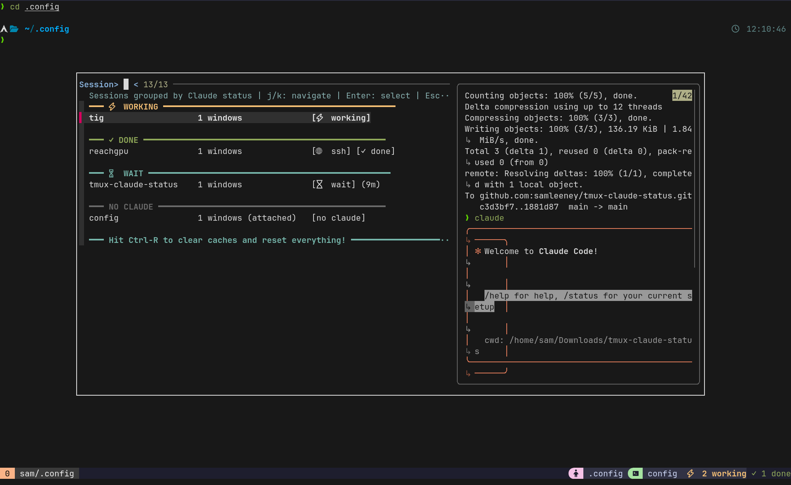

# tmux-claude-status

See Claude AI activity across all tmux sessions at a glance.



## Features

- **Hook-based Detection** - Uses Claude Code's official hooks for accurate status
- **Visual Status** - `[⚡ working]` when Claude is processing, `[✓ done]` when idle
- **Smart Grouping** - Sessions organized by Claude status
- **Live Preview** - See session content while browsing
- **Vim Navigation** - Use `j/k` to navigate
- **SSH Support** - Detects Claude status in SSH sessions via remote status files
- **Status Bar Integration** - Shows Claude status in tmux status bar
- **Notification Sound** - Plays a sound when Claude finishes processing

## Install

### 1. Install the plugin

With TPM:
```bash
set -g @plugin 'samleeney/tmux-claude-status'
```

Manual:
```bash
git clone https://github.com/samleeney/tmux-claude-status ~/.config/tmux/plugins/tmux-claude-status
run-shell ~/.config/tmux/plugins/tmux-claude-status/tmux-claude-status.tmux
```

### 2. Set up Claude Code hooks

Add to your `~/.claude/settings.json`:
```json
{
  "hooks": {
    "PreToolUse": [
      {
        "hooks": [
          {
            "type": "command",
            "command": "~/.config/tmux/plugins/tmux-claude-status/hooks/better-hook.sh PreToolUse"
          }
        ]
      }
    ],
    "Stop": [
      {
        "hooks": [
          {
            "type": "command", 
            "command": "~/.config/tmux/plugins/tmux-claude-status/hooks/better-hook.sh Stop"
          }
        ]
      }
    ]
  }
}
```

## Usage

Press `prefix + s` to open the enhanced session switcher.

### Status Bar

The plugin automatically adds Claude status to your tmux status bar:
- `✓ All Claudes ready` - All Claude instances are idle
- `⚡ N Claude(s) working` - Shows number of Claude instances currently processing

A notification sound plays when any Claude finishes processing.

## How It Works

The plugin uses [Claude Code hooks](https://docs.anthropic.com/en/docs/claude-code/hooks) to track status:
- `PreToolUse` - Sets status to "working" when Claude starts running tools
- `Stop` - Sets status to "done" when Claude finishes processing

Status files are stored in `~/.cache/tmux-claude-status/{session_name}.status`

### SSH Sessions

To set up Claude status tracking for SSH servers, run the setup script once per server:

```bash
./setup-server.sh <session-name> <ssh-host>
```

**Example:**
```bash
./setup-server.sh reachgpu reachgpu
```

This single script:
- Maps the remote hostname to your session name
- Copies the hook to the remote server
- Sets up Claude hooks on the remote machine

After setup, use standard SSH commands:
```bash
ssh reachgpu
claude  # Status will show in your local session switcher
```

SSH sessions display as: `session-name [🌐 ssh] [⚡ working]`

## License

MIT
